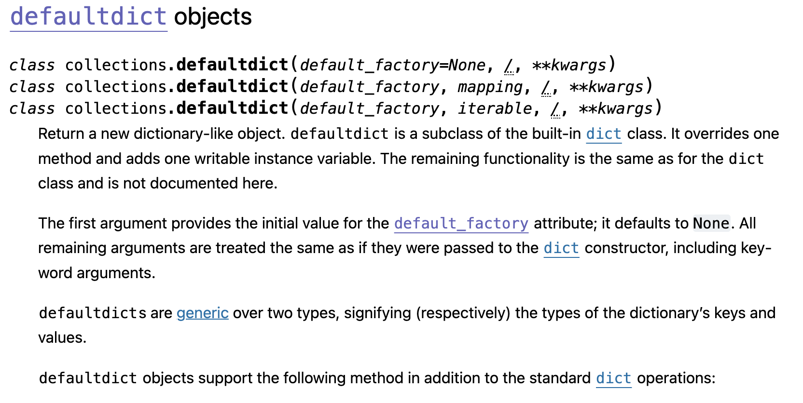

### 문제 설명  
- 풀이 URL : [추억 점수](https://github.com/thisischeese/codingTest/tree/main/%ED%94%84%EB%A1%9C%EA%B7%B8%EB%9E%98%EB%A8%B8%EC%8A%A4/1/176963.%E2%80%85%EC%B6%94%EC%96%B5%E2%80%85%EC%A0%90%EC%88%98)

### 접근 방식 : 1. 단순 구현 defaultdict 사용 

- 왜 이 방식으로 풀었나?
    - 그리움 점수가 주어지지 않은 인물의 점수는 0점으로 처리해야 함 -> 자료구조에 조회가 들어왔을 떄 0으로 반환해줘야 함 : defaultdict 
    - photos 는 결국 한 번씩은 조회해야 photo별 점수를 계산할 수 있음(photo 간의 관계 없으므로 누적 계산 등 불가) -> 단순 이중 for 문. 
    - 이중 for 문이지만 photo 길이도 100뿐이고 photo 원소 최대 7개 => O(n*k)이지만 700번 조회 => 1e8 관점에서 충분 
- 시간복잡도, 공간복잡도 관점에서의 성능 비교 
    - 메모리: 11.9 MB, 시간: 0.65 ms
    - 시간 더 줄일 수 있을 것 같음 

### 접근 방식 : 2. dict + zip + 리스트 컴프리헨션 => 짧은 코드 
- 왜 이 방식으로 풀었나?
    - 조회만 발생하는 상황에서 defaultdict과 dict의 성능 차이가 있을까? 
    - defaultdict는 dict의 서브클래스이며 내부 해시 테이블 구현이 dict와 동일 
    - dict 클래스에 default_factory와 누락 키 처리 로직만 추가된 것임 
    - 뭔가 혁신적으로 조회 성능이 달라질 일이 xx 
    
    - 사실 defaultdict까지 사용하지 않아도 된다. 그냥 dict 에서 get할 때 0를 기본값 인자로 지정하면 됨 
- 시간복잡도, 공간복잡도 관점에서의 성능 비교 
    - 메모리: 12 MB, 시간: 0.57 ms 
    - .. 그냥 시간과 메모리 tradeoff인 것 같기도.. 
    - 뭔가 더 짧은 코드일 뿐 더 좋은 코드는 아닌 것 같기도 하다. 

### 회고 
- 몇 번만에 성공했는지 : 1
- 잘한 점 : 자료구조를 문제 의도에 적절히 매칭했음. 
- 개선할 점 : defaultdict 내부 구조를 오늘 알았음. 공식 문서를 조금 더 찾아볼 필요가 있을 듯 